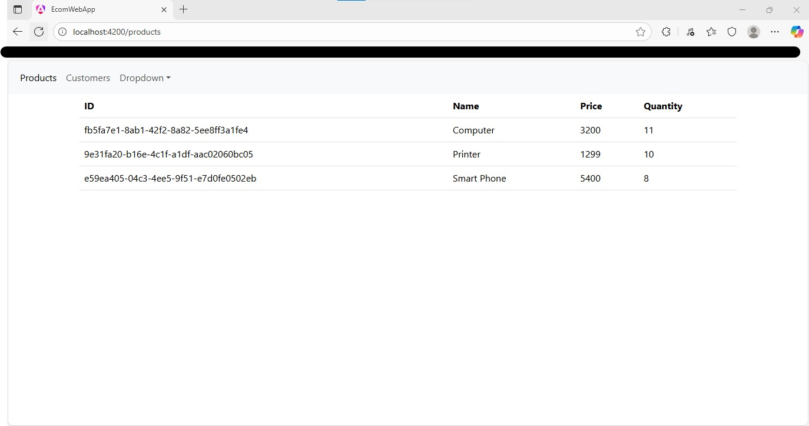
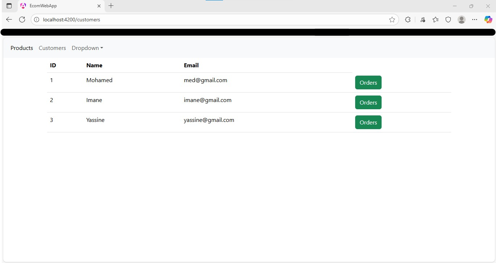

<h2>Partie Back-end</h2>

<h2>La liste des clients dans la base h2</h2>

<h2>La liste des clients avec Spring Data Rest</h2>

<h2>Affichage d'un client par id avec Spring Data Rest</h2>

<h2>Affichage d'un client par id avec Spring Data Rest(Projection)</h2>

<h2>La liste des Produits avec Spring Data Rest</h2>

<h2>Affichage d'un Produit par id avec Spring Data Rest</h2>

<h2>Actuator</h2>

<h2>La liste des clients avec Gateway</h2>

<h2>La liste des Produits avec Gateway</h2>

<h2>Interface eureka discovery service</h2>

<h2>La list des services enregistré </h2>

<h2>La liste des clients avec Gateway Dynamic</h2>

<h2>La liste des Produits avec Gateway Dynamic</h2>

<h2>La liste des factures dans la base h2</h2>

<h2>La liste des Product_items dans la base h2</h2>

<h2>La liste des bills avec Gateway Dynamic</h2>

<h2>Affichage d'une facture par id avec Gateway Dynamic</h2>

<h2>Affichage du configuration par defaut</h2>

<h2>Affichage du configuration par defaut du client</h2>

<h2>Affichage du configuration de dev du client</h2>

<h2>Ensemble du service dans Discovery-service</h2>

<h2>Une application Web qui permet d'afficher les résultats du Stream Data Analytics en temps réel</h2>

<h2>Chatbot:Des captures d’écran du code ont été jointes,car  la clé API OpenAI ne fonctionnant pas</h2>

<h2>Communication avec le Billing service  via OpenFeign </h2>

<h2>Configuration avec Keycloak</h2>

<h2>MCP tool </h2>

<h2>Création d'un client </h2>

<h2>test d'authentification pour GET produit </h2>

<h2>test d'authentification dans app angular </h2>

<h2>Creation du copmte  USERS par defaut dans app angular </h2>

<h2>OTP user2 </h2>

<h2>Partie Front-end</h2>
<h2> list des  Produits</h2>

<h2> list des  clients</h2>

<h2> Facture par client</h2>

<h2> Detail de facture par client</h2>

